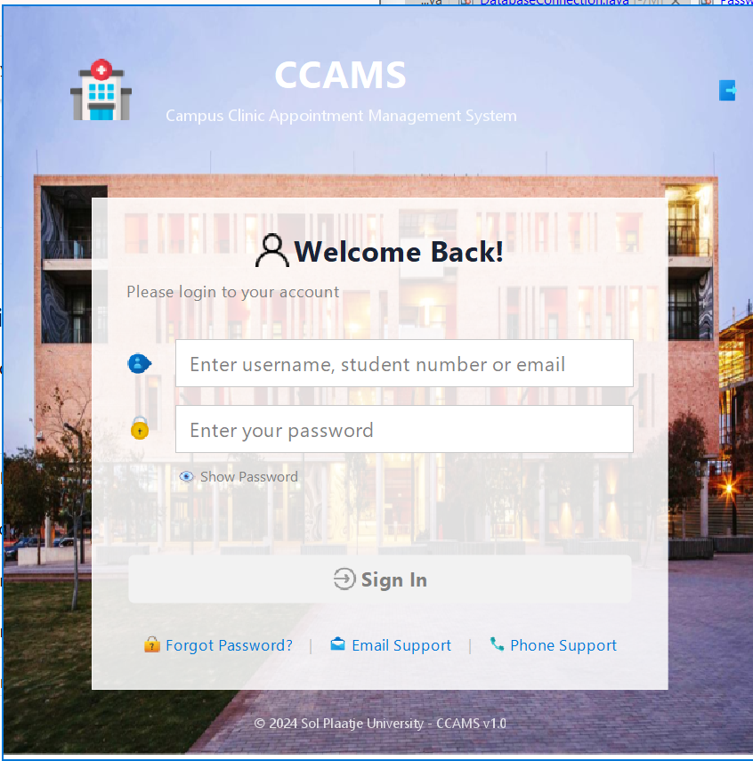
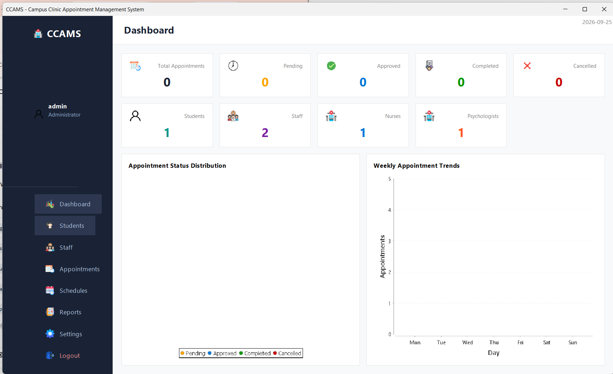
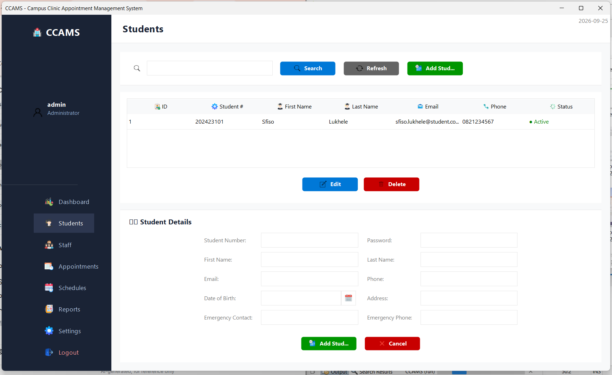
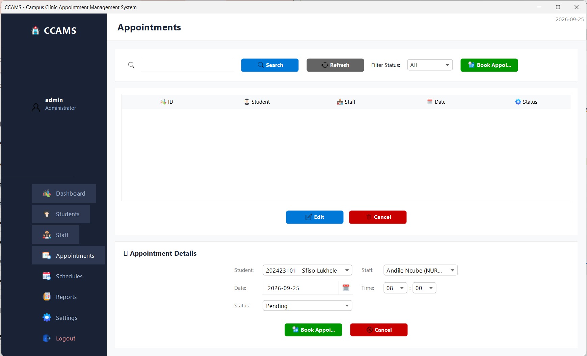

<div align="center">

<!-- Project Banner -->


<!-- Badges -->
[](https://www.oracle.com/java/)
[](https://netbeans.apache.org/)
[](https://www.mysql.com/)
[](LICENSE)
[]()

<!-- Description -->
**A comprehensive desktop application developed for Sol Plaatje University to automate the clinic appointment booking process, replacing the manual email-based system.**

[Features](#-key-features) · [Installation](#-installation) · [Usage](#-usage) · [Screenshots](#-screenshots) · [Documentation](#-documentation) · [Contact](#-contact)

</div>

---

## 📖 About The Project

**CCAMS** (Campus Clinic Appointment Management System) is a Java Swing desktop application that streamlines the entire appointment management process for university clinics. It eliminates the inefficiencies of manual email-based booking by providing:

<table>
<tr>
<td width="50%">

### 🎯 Project Goals
- Automate appointment booking
- Eliminate email delays
- Real-time availability
- Role-based access
- Professional reporting

</td>
<td width="50%">

### 💡 Key Benefits
- ⚡ **Faster** appointment scheduling
- 📊 **Better** clinic analytics
- 🔒 **Secure** role-based access
- 📱 **Modern** user interface
- 📈 **Scalable** architecture

</td>
</tr>
</table>

---

## ✨ Key Features

<table>
<tr>
<td width="50%" valign="top">

### 🔐 Authentication
- Login with username, student number, or email
- Role-based access control (Admin, Nurse, Psychologist, Student)
- SHA-256 password hashing
- Show/Hide password toggle
- Placeholder field guidance

### 👨‍🎓 Student Management
- Register new students
- View, search, and filter students
- Update student profiles
- Soft delete (deactivate)
- Date picker for Date of Birth

### 👨‍⚕️ Staff Management
- Add Nurses and Psychologists
- View all staff members
- Search and filter by profession
- Update staff profiles
- Track availability status

</td>
<td width="50%" valign="top">

### 📅 Appointment Management
- Book appointments with date/time picker
- Approve/Complete/Cancel appointments
- Reschedule with reason tracking
- Filter by status
- Interactive calendar

### 🕐 Schedule Management
- Add and manage staff schedules
- View all schedules
- Update and delete schedules
- Filter by staff member

### 📊 Reports & Analytics
- Summary, Weekly, Monthly, Annual reports
- Appointment statistics
- Student & Staff reports
- JasperReports integration

</td>
</tr>
</table>

---

## 🛠️ Built With

<div align="center">

| **Category** | **Technology** |
|:------------:|:---------------|
| **Language** |  |
| **IDE** |  |
| **Database** |  |
| **UI Framework** |  |
| **Charting** |  |
| **Reporting** |  |
| **Build Tool** |  |
| **Version Control** |  |

</div>

---

## 🏗️ Architecture

## 📁 Project Structure

┌─────────────────────────────────────────────────────────────┐
│ PRESENTATION LAYER │
│ ┌──────────┐ ┌──────────┐ ┌──────────┐ ┌──────────┐ │
│ │ Dashboard│ │ Students │ │ Staff │ │Appointments│ │
│ └──────────┘ └──────────┘ └──────────┘ └──────────┘ │
├─────────────────────────────────────────────────────────────┤
│ BUSINESS LAYER │
│ ┌──────────────┐ ┌──────────────┐ ┌──────────────┐ │
│ │ ReportServ. │ │ SettingsServ.│ │ Controllers │ │
│ └──────────────┘ └──────────────┘ └──────────────┘ │
├─────────────────────────────────────────────────────────────┤
│ DATA ACCESS LAYER │
│ ┌──────────┐ ┌──────────┐ ┌──────────┐ ┌──────────┐ │
│ │ UserDAO │ │StudentDAO│ │ StaffDAO │ │AppointmentDAO│ │
│ └──────────┘ └──────────┘ └──────────┘ └──────────┘ │
├─────────────────────────────────────────────────────────────┤
│ DATABASE LAYER │
│ ┌────────────────────────────┐ │
│ │ MySQL Database │ │
│ └────────────────────────────┘ │
└─────────────────────────────────────────────────────────────┘


---

## 📁 Project Structure

CCAMS/
├── 📂 src/
│ └── 📂 ccams/
│ ├── 📂 auth/ # Authentication module
│ ├── 📂 constants/ # Application constants
│ ├── 📂 dao/ # Data Access Objects
│ ├── 📂 database/ # Database connection
│ ├── 📂 models/ # Data models
│ ├── 📂 services/ # Business logic
│ ├── 📂 utils/ # Utility classes
│ ├── 📂 views/ # GUI views
│ └── 📂 resources/
│ ├── 📂 icons/ # Application icons
│ └── 📂 images/ # Images & assets
├── 📂 lib/ # External libraries
├── 📂 reports/ # JasperReports templates
├── 📂 config/ # Configuration files
├── 📂 docs/ # Documentation
├── 📄 README.md
└── 📄 LICENSE


---

## 🚀 Installation

### Prerequisites

<div align="center">

| Requirement | Version | Download |
|:-----------:|:-------:|:--------:|
| **JDK** | 22+ | [Download](https://www.oracle.com/java/technologies/downloads/) |
| **MySQL** | 8.0+ | [Download](https://dev.mysql.com/downloads/mysql/) |
| **NetBeans** | 22+ | [Download](https://netbeans.apache.org/download/) |

</div>

### Quick Start

```bash
# 1. Clone the repository
git clone https://github.com/Mxolisi78/CCAMS.git
cd CCAMS

# 2. Open in NetBeans
# File → Open Project → Select CCAMS folder

# 3. Setup database
# Run database_schema.sql in MySQL Workbench

# 4. Configure database connection
# Edit src/ccams/database/DatabaseConnection.java

# 5. Run the application
# Right-click CCAMS.java → Run File

🔑 Default Credentials
<table align="center"> <tr> <th>Role</th> <th>Username</th> <th>Password</th> </tr> <tr> <td>👑 Administrator</td> <td><code>admin</code></td> <td><code>admin123</code></td> </tr> <tr> <td>👨‍⚕️ Nurse</td> <td><code>andile.ncube</code></td> <td><code>password123</code></td> </tr> <tr> <td>🧠 Psychologist</td> <td><code>samke.zondo</code></td> <td><code>password123</code></td> </tr> <tr> <td>👨‍🎓 Student</td> <td><code>202423101</code></td> <td><code>password123</code></td> </tr> </table>
📸 Screenshots
<div align="center">
🔐 Login Screen

📊 Dashboard

👨‍🎓 Student Management

📅 Appointment Management
</div>
📊 Reports Available
#	Report Type	Description
1	📈 Summary Report	Complete clinic statistics overview
2	📋 Appointment Summary	Custom date range analysis
3	📅 Weekly Report	Last 7 days performance
4	📆 Monthly Report	Last 30 days performance
5	🗓️ Annual Report	Last 365 days performance
6	👨‍🎓 Student Report	All registered students
7	👨‍⚕️ Staff Report	All clinic staff members
🗺️ Roadmap
<table> <tr> <td>
✅ Completed
☑ User authentication
☑ Student management
☑ Staff management
☑ Appointment management
☑ Schedule management
☑ Reports module
☑ Modern UI with FlatLaf
☑ Date picker integration
</td> <td>
🚧 In Progress
□ Email notifications
□ SMS reminders
□ PDF export
□ Excel export
□ Audit logging
</td> </tr> <tr> <td>
📅 Planned
□ Mobile app integration
□ Online booking portal
□ Calendar view
□ Dark mode toggle
</td> <td>
💡 Future Ideas
□ AI-powered scheduling
□ Video consultations
□ Digital prescriptions
□ Integration with university systems
</td> </tr> </table>
🤝 Contributing
Contributions are what make the open source community such an amazing place to learn, inspire, and create. Any contributions you make are greatly appreciated.

Fork the Project

Create your Feature Branch (git checkout -b feature/AmazingFeature)

Commit your Changes (git commit -m 'Add some AmazingFeature')

Push to the Branch (git push origin feature/AmazingFeature)

Open a Pull Request

📄 License
Distributed under the MIT License. See LICENSE for more information.

text
MIT License

Copyright (c) 2024 Sol Plaatje University

Permission is hereby granted, free of charge, to any person obtaining a copy
of this software and associated documentation files (the "Software"), to deal
in the Software without restriction...
📧 Contact
<div align="center">
Mxolisi Mtshali

https://img.shields.io/badge/GitHub-Mxolisi78-181717?style=for-the-badge&logo=github
https://img.shields.io/badge/Email-ismailmxolisi78@gmail.com-D14836?style=for-the-badge&logo=gmail&logoColor=white
https://img.shields.io/badge/LinkedIn-Connect-0A66C2?style=for-the-badge&logo=linkedin

Project Link: https://github.com/Mxolisi78/CCAMS

</div>
🙏 Acknowledgments
<table align="center"> <tr> <td align="center" width="33%">
🎓 Institution
Sol Plaatje University


For the project opportunity

</td> <td align="center" width="33%">
👨‍🏫 Supervisor
Project Supervisor


For guidance & support

</td> <td align="center" width="33%">
🛠️ Libraries
Open Source Community


FlatLaf, JFreeChart, JasperReports

</td> </tr> </table>
<div align="center">
⭐ Show Your Support
If this project helped you, please give it a ⭐️!

https://img.shields.io/github/stars/Mxolisi78/CCAMS?style=social
https://img.shields.io/github/forks/Mxolisi78/CCAMS?style=social


Made with ❤️ for Sol Plaatje University

© 2024 CCAMS - Campus Clinic Appointment Management System

</div> ```
